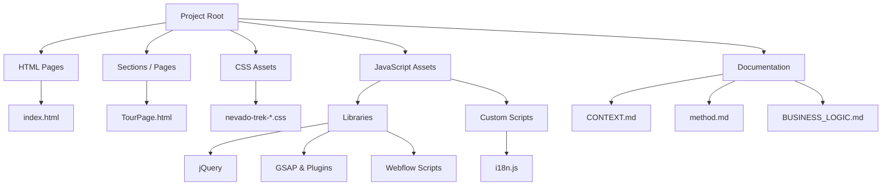
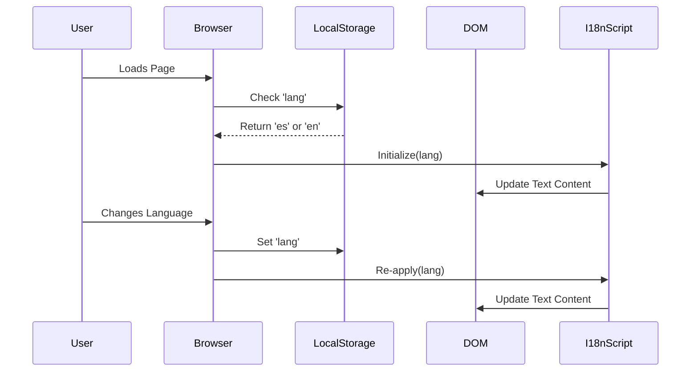

# Nevado Trek Web Architecture

## 1. High-Level Overview

Nevado Trek Web is a static, multi-page website originally designed in Webflow and exported for local hosting and customization. The project focuses on high performance, internationalization (Spanish/English), and a premium user experience with GSAP animations.

## 2. Project Structure

## 3. Frontend Architecture

### 3.1 Core Technologies
*   **HTML5**: Semantic structure exported from Webflow.
*   **CSS3**: Custom Webflow export + manual overrides.
*   **JavaScript (ES6+)**:
    *   **Libraries**: jQuery (Webflow dependency), GSAP (Animations), WebFont Loader.
    *   **Custom Logic**: Internationalization (`i18n.js`), Dynamic Content (Comments), UI Interactions.

### 3.2 Asset Management Strategy
To ensure performance and independence from external dependencies, all core assets are localized.

*   **Flow**: `CDN` -> `Download` -> `Local Directory` -> `HTML Reference`
*   **CSS**: Stored in `/css`.
*   **JS**: Stored in `/js`.
*   **Images**: Currently served via Webflow CDN (optimization pending).

### 3.3 Internationalization (i18n) System
*   **State**: `localStorage.getItem('lang')` (persists user preference).
*   **Data Source**: `window.NT_I18N` object in `js/i18n.js`.
*   **Execution**:
    1.  Script detects language on load.
    2.  `apply(lang)` function iterates over `[data-i18n-key]` elements.
    3.  Specific text nodes are updated via DOM manipulation.

## 4. Page Architecture

### 4.1 Landing Page (`index.html`)
*   **Header**: Sticky, language switcher.
*   **Hero**: Video/Image background, dynamic text.
*   **Sections**: Tours, Services, Gallery, Testimonials (Dynamic), Footer.

### 4.2 Tour Page (`Sections/TourPage.html`)
*   **Status**: Standalone template (in progress).
*   **Structure**:
    *   Hero Section (Image/Video).
    *   Tour Details (Price, Duration, Difficulty).
    *   Itinerary.
    *   Inclusions/Exclusions.
    *   Booking CTA.
*   **Assets**: Fully localized (CSS/JS).

## 5. Data Flow & State

## 6. Future Component System (Planned)
As outlined in `method.md`, the project aims to move towards a component-based architecture for shared elements.

*   **Components**: Header, Footer, Tour Card.
*   **Loader**: `js/components.js` (to be implemented).
*   **Goal**: Reduce code duplication across `index.html` and `Sections/*.html`.
