# Sistema de Reservas (Booking Modal)

Documentación completa del modal de reservas implementado en la TourPage para gestionar reservas de tours.

## Índice

1. [Arquitectura General](#arquitectura-general)
2. [Flujo de Usuario (UX Flow)](#flujo-de-usuario)
3. [Componentes del Sistema](#componentes-del-sistema)
4. [Integración con API](#integración-con-api)
5. [Internacionalización (i18n)](#internacionalización)
6. [Estructura de Archivos](#estructura-de-archivos)

---

## Arquitectura General


### Diagrama de Dependencias

```
TourPage.html
├── css/booking-modal.css (estilos del modal)
├── js/tour-loader.js (carga datos del tour)
│   └── js/booking-modal.js (lógica del modal)
│       └── js/services/api.js (cliente API)
```

---

## Flujo de Usuario

```mermaid
flowchart TD
    A["Click 'Reservar Tour'"] --> B[Modal Abre]
    B --> C{¿Hay fechas públicas?}
    
    C -->|Sí| D[Mostrar tarjetas de fechas]
    C -->|No| E[Mostrar solo opción privada]
    
    D --> F{Usuario elige}
    F -->|Fecha pública| G[Seleccionar tarjeta]
    F -->|Fecha privada| H[Abrir date picker]
    
    E --> H
    G --> I["Step 2: Formulario"]
    H --> I
    
    I --> J[Validar campos]
    J -->|Error| K[Mostrar errores]
    J -->|OK| L["Step 3: Resumen"]
    
    L --> M[Usuario revisa total]
    M --> N[Click Confirmar]
    
    N --> O{Tipo de reserva}
    O -->|Pública| P["POST /bookings/join"]
    O -->|Privada| Q["POST /bookings/private"]
    
    P --> R[Toast + Success Screen]
    Q --> R
    
    R --> S[Mostrar Booking ID]
```



### Estados del Modal

| Estado | Descripción |
|--------|-------------|
| **Cerrado** | Modal oculto, overlay invisible |
| **Step 1** | Selección de fecha (pública o privada) |
| **Step 2** | Formulario de datos del cliente |
| **Step 3** | Resumen con precio total |
| **Loading** | Enviando reserva a API |
| **Success** | Reserva completada, mostrar código |
| **Error** | Mensaje de error visible |

---

## Componentes del Sistema

### 1. Modal Container

```
.booking-modal
├── .booking-modal-overlay (fondo blur)
├── .booking-modal-content (contenedor principal)
│   ├── .booking-modal-close (botón X)
│   ├── .booking-modal-header
│   │   ├── .booking-modal-title (h1 styles)
│   │   └── .booking-modal-tour-name
│   └── .booking-modal-grid
│       ├── .booking-modal-info (columna izquierda)
│       └── .booking-modal-form (columna derecha)
```

### 2. Columna Izquierda (Info)

| Sección | Contenido |
|---------|-----------|
| **Pricing Tiers** | 4 niveles de precio por número de personas |
| **Why Book Direct** | Beneficios de reservar directo |
| **Important Notes** | Notas sobre confirmación y pago |

### 3. Columna Derecha (Form Steps)

```mermaid
stateDiagram-v2
    [*] --> Step1
    Step1 --> Step2: Fecha seleccionada
    Step2 --> Step1: Botón Volver
    Step2 --> Step3: Validación OK
    Step3 --> Step2: Botón Volver
    Step3 --> Success: API OK
    Step3 --> Error: API Error
    Success --> [*]: Cerrar modal
```



### 4. Date Cards (Tarjetas de Fecha)

```
.date-card
├── .date-card-day (número del día)
├── .date-card-month (nombre del mes)
├── .date-card-slots (cupos disponibles + indicador)
└── .date-card-price (precio por persona)
```

Estados:
- **Default**: Borde gris, hover sutil
- **Hover**: Borde más visible, background claro
- **Selected**: Borde azul, background azul transparente
- **Low Slots**: Indicador amarillo (≤3 cupos)

### 5. Booking Summary

```
.booking-summary
├── Tour name
├── Selected date
├── Number of guests
├── Price per person
└── Total (highlighted in green)
```

---

## Integración con API

### Endpoints Utilizados

#### POST /public/bookings/join
Unirse a una salida pública existente.

```javascript
{
  "departureId": "wHeL7YEtpqTZfhTDxEtL",
  "customer": {
    "name": "Juan Pérez",
    "email": "juan@example.com",
    "phone": "+573001234567",
    "document": "1234567890",
    "note": "Soy vegetariano"
  },
  "pax": 2
}
```

#### POST /public/bookings/private
Solicitar una nueva fecha privada.

```javascript
{
  "tourId": "Au3wVFDw6Y2YlEtSlLoS",
  "date": "2025-12-25",
  "customer": {
    "name": "María García",
    "email": "maria@example.com",
    "phone": "+573009876543",
    "document": "9876543210",
    "note": "Guía bilingüe"
  },
  "pax": 4
}
```

### Manejo de Errores

| Código | Acción |
|--------|--------|
| **200** | Mostrar success + toast |
| **400** | Mostrar error de validación |
| **429** | Mostrar mensaje de rate limit |
| **500** | Mostrar error genérico |

---

## Internacionalización

### Idiomas Soportados

| Código | Idioma | Moneda |
|--------|--------|--------|
| `es` | Español | COP (Peso Colombiano) |
| `en` | English | USD (US Dollar) |

### Formato de Precios

```javascript
// Español
formatCOP(540000) // "$540.000"

// English  
formatUSD(135) // "$135"
```

### Textos Traducidos

Los textos están definidos en el objeto `translations` dentro de `booking-modal.js`:

```javascript
const translations = {
  es: {
    title: 'RESERVAR TOUR',
    step1: 'Fecha',
    step2: 'Datos',
    step3: 'Resumen',
    // ... más traducciones
  },
  en: {
    title: 'BOOK TOUR',
    step1: 'Date',
    step2: 'Details',
    step3: 'Summary',
    // ... more translations
  }
};
```

### Cambio de Idioma en Tiempo Real

El modal escucha el evento `languageChange` para actualizar:
- Títulos y labels
- Precios (COP ↔ USD)
- Textos de botones
- Mensajes de error

---

## Estructura de Archivos

```
NevadoTrekWeb01/
├── css/
│   └── booking-modal.css     # Estilos del modal
├── js/
│   ├── booking-modal.js      # Lógica del modal
│   ├── tour-loader.js        # Inicialización
│   └── services/
│       └── api.js            # Cliente API
└── Sections/
    └── TourPage.html         # Página del tour
```

### booking-modal.css

| Sección | Líneas | Descripción |
|---------|--------|-------------|
| Overlay | 6-22 | Fondo oscuro con blur |
| Modal Container | 24-45 | Posicionamiento y animación |
| Modal Content | 47-62 | Dimensiones (90% height, 5em margin) |
| Header | 88-110 | Título h1 y nombre del tour |
| Grid Layout | 112-130 | Dos columnas |
| Pricing Tiers | 147-175 | Tabla de precios |
| Date Cards | 216-285 | Tarjetas de fechas |
| Form Inputs | 310-390 | Inputs con border 8px |
| Summary | 400-460 | Resumen de reserva |
| Buttons | 465-530 | Botones CTA |
| Success | 535-600 | Estado de éxito |
| Toast | 610-640 | Notificación verde |
| Responsive | 700-750 | Mobile adaptations |

### booking-modal.js

| Función | Descripción |
|---------|-------------|
| `initBookingModal(tour, departures)` | Inicializa el modal con datos |
| `createModalHTML()` | Genera el HTML dinámico |
| `bindEvents()` | Conecta event listeners |
| `openModal()` | Abre el modal |
| `closeModal()` | Cierra el modal |
| `renderPricingTiers()` | Renderiza tabla de precios |
| `renderDateCards()` | Renderiza tarjetas de fechas |
| `goToStep(n)` | Navega entre pasos |
| `validateForm()` | Valida campos del formulario |
| `updateSummary()` | Calcula y muestra resumen |
| `handleSubmit()` | Envía reserva a API |
| `showToast()` | Muestra notificación verde |
| `showSuccess(bookingId)` | Muestra pantalla de éxito |

---

## Especificaciones de Diseño

### Colores

| Variable | Valor | Uso |
|----------|-------|-----|
| `--color--dark` | #042e4d | Fondo del modal |
| `--color--light` | white | Texto principal |
| `--color--blue-dark` | #8fbbd3 | Texto secundario, labels |
| `#2563eb` | Blue | Botones CTA, selección |
| `#10b981` | Green | Success, total, toast |
| `--pink` | #ed155c | Errores |

### Tipografía

| Elemento | Font | Size | Weight |
|----------|------|------|--------|
| Título modal | Inter | 38px | 700 |
| Nombre tour | Inter | 1.2em | 400 |
| Labels | Inter | 0.85em | 400 |
| Inputs | Inter | 1em | 400 |
| Buttons | Inter | 1em | 600 |

### Espaciado

| Elemento | Valor |
|----------|-------|
| Modal margin | 5em (horizontal) |
| Modal height | 90vh |
| Grid gap | 56px |
| Form gap | 20px |
| Border radius (inputs) | 8px |
| Border radius (cards) | 12px |

---

## Testing Checklist

- [x] Modal abre al click en "Reservar Tour"
- [x] Fechas públicas se muestran como cards
- [x] Seleccionar fecha lleva a Step 2
- [x] Toggle switch activa/desactiva date picker
- [x] Date picker abre al click en todo el input
- [x] Date picker se reinicia al activar toggle
- [x] Step 2 muestra resumen de fecha seleccionada
- [x] Validación de campos funciona
- [x] Step 3 muestra resumen correcto
- [x] Precio total se calcula correctamente según tier
- [x] Cambio de idioma actualiza textos y precios
- [x] Toast verde aparece al enviar
- [x] Success screen muestra booking ID
- [x] Modal se cierra con X, overlay, o ESC
- [x] Departures se refrescan al abrir modal
- [x] No se muestran departures con 0 cupos
- [ ] Responsive funciona en mobile

---

## Gestión de Datos y Cache

### Cache Bypass para Datos Frescos

El endpoint `/public/departures` tiene cache de CDN (30-60 segundos). Para obtener datos actualizados después de un booking:

```javascript
// api.js - getDepartures con forceRefresh
async getDepartures(forceRefresh = false) {
  let url = `${API_BASE_URL}/public/departures`;
  
  // Bypass cache añadiendo timestamp
  if (forceRefresh) {
    url += `?t=${Date.now()}`;
    console.log('🔄 Fetching departures with cache bypass');
  }
  
  const response = await fetch(url);
  return await response.json();
}
```

### Cuándo usar Cache Bypass

| Situación | Cache |
|-----------|-------|
| Carga inicial de página | Normal (aprovecha cache) |
| Abrir modal de reserva | **Bypass** (siempre datos frescos) |
| Después de booking exitoso | **Bypass** |
| Polling automático | Normal |

### Filtrado de Departures

El filtrado se aplica en **dos capas**:


**Backend** (defensivo primario):
```javascript
// Solo retorna departures con cupos disponibles
.filter((dep) => dep.currentPax < dep.maxPax)
```

**Frontend** (defensivo secundario):
```javascript
// Filtro adicional por si acaso
currentDepartures = freshDepartures.filter(d => {
  const available = (d.maxPax || 8) - (d.currentPax || 0);
  return d.tourId === currentTour.tourId && 
    d.status === 'open' &&
    new Date(d.date._seconds * 1000) >= new Date() &&
    available > 0;
});
```

---

## Componentes Nuevos

### Toggle Switch para Fecha Privada

Reemplazó el botón clickeable por un switch on/off:

```html
<div class="private-date-toggle">
  <div class="toggle-left">
    <svg><!-- calendar icon --></svg>
    <span>Solicitar una fecha diferente</span>
  </div>
  <label class="toggle-switch">
    <input type="checkbox" id="private-date-checkbox">
    <span class="toggle-slider"></span>
  </label>
</div>
```

**Comportamiento:**
- Al activar: Muestra date picker, deselecciona date cards, resetea valor del picker
- Al desactivar: Oculta date picker

### Resumen de Fecha en Step 2

Muestra la fecha seleccionada en el paso anterior:

```html
<div class="selected-date-summary">
  <div class="summary-date-info">
    <span class="summary-date-label">Tu fecha seleccionada</span>
    <span class="summary-date-value" id="step2-date-display">
      domingo, 15 de diciembre de 2025
    </span>
  </div>
  <button class="change-date-btn">Cambiar</button>
</div>
```

---

## Cálculo de Precios

### Lógica de Pricing Tiers

El precio mostrado en las tarjetas de fecha se calcula basado en el **total de personas después de unirse**:

```javascript
// IMPORTANTE: Precio basado en currentPax + 1 (mínimo)
const totalPeopleAfterBooking = currentPax + 1;
const price = getFormattedPrice(pricingTiers, totalPeopleAfterBooking);
```

**Ejemplo:**
| currentPax | Tier Aplicado | Precio Mostrado |
|------------|---------------|-----------------|
| 0 | 1 persona | $98,000 |
| 1 | 2 personas | $72,000 |
| 2 | 3 personas | $80,000 |
| 3+ | 4-8 personas | $54,000 |

### Función getFormattedPrice

```javascript
function getFormattedPrice(pricingTiers, currentPax = 1) {
  // Encontrar tier correspondiente
  const tier = pricingTiers.find(t => 
    currentPax >= t.minPax && currentPax <= t.maxPax
  ) || pricingTiers[pricingTiers.length - 1];

  return currentLang === 'en' 
    ? formatUSD(tier.priceUSD) 
    : formatCOP(tier.priceCOP);
}
```

---

## Changelog

### v1.1.0 (2025-12-06)
- ✅ Implementado cache bypass con `?t=Date.now()`
- ✅ Backend filtra departures llenas (`currentPax < maxPax`)
- ✅ Frontend con filtro defensivo adicional
- ✅ Toggle switch para fecha privada
- ✅ Reset automático del date picker
- ✅ Resumen de fecha en Step 2
- ✅ Precio calculado según currentPax + 1
- ✅ Datos se refrescan al abrir modal

### v1.0.0 (2025-12-05)
- ✅ Modal de reserva funcional
- ✅ 3 pasos: Fecha → Datos → Resumen
- ✅ Integración con API (join + private)
- ✅ i18n (ES/EN) con monedas (COP/USD)
- ✅ Toast de éxito
- ✅ Pantalla de confirmación
